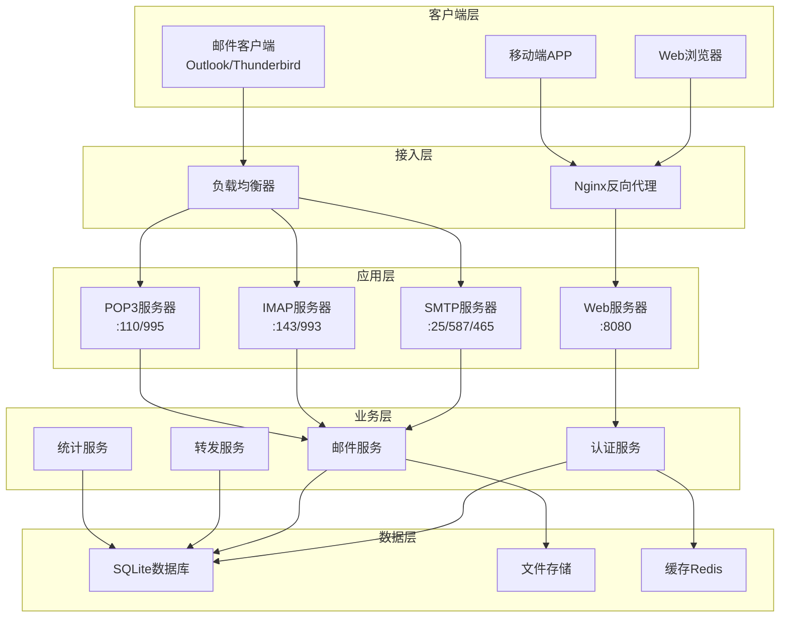

<div align="center">

# 🚀 Miko邮箱系统设计文档


**一个现代化、高性能的企业级邮件服务器解决方案**

[📖 快速开始](#-快速开始) • [🏗️ 系统架构](#️-系统架构) • [📊 API文档](#-api接口设计) • [🔧 部署指南](#-部署架构)

</div>

---

## 📋 目录

- [项目概述](#-项目概述)
- [系统架构](#️-系统架构)
- [技术栈](#-技术栈)
- [目录结构](#-目录结构)
- [核心模块设计](#-核心模块设计)
- [数据模型设计](#-数据模型设计)
- [API接口设计](#-api接口设计)
- [配置管理](#️-配置管理)
- [安全设计](#-安全设计)
- [部署架构](#-部署架构)
- [性能优化](#⚡-性能优化)
- [监控和日志](#-监控和日志)
- [扩展性设计](#-扩展性设计)
- [测试策略](#-测试策略)
- [维护和运维](#-维护和运维)

---

## 🎯 项目概述

**Miko邮箱系统**是一个基于Go语言开发的现代化邮件服务器解决方案，采用微服务架构设计，支持完整的邮件协议栈，提供企业级的邮件服务能力。

### ✨ 核心特性

<table>
<tr>
<td width="50%">

**🚀 协议支持**
- ✅ SMTP (25/587/465)
- ✅ IMAP (143/993)
- ✅ POP3 (110/995)
- ✅ HTTP/HTTPS Web界面

</td>
<td width="50%">

**🌐 管理功能**
- ✅ 现代化Web管理界面
- ✅ 多域名邮箱服务
- ✅ 用户权限管理
- ✅ 实时监控面板

</td>
</tr>
<tr>
<td width="50%">

**🔒 安全特性**
- ✅ JWT + Session双重认证
- ✅ 密码加密存储
- ✅ SQL注入防护
- ✅ XSS/CSRF防护

</td>
<td width="50%">

**📨 高级功能**
- ✅ 智能邮件转发
- ✅ 验证码自动提取
- ✅ 邮件统计分析
- ✅ 批量操作支持

</td>
</tr>
</table>

---

## 🏗️ 系统架构

### 🎨 整体架构图



### 🔧 技术栈

<div align="center">

| 层级 | 技术选型 | 说明 |
|------|----------|------|
| **后端框架** |   | 高性能Web框架 |
| **数据库** |  | 轻量级嵌入式数据库 |
| **前端** |    | 现代化前端技术栈 |
| **认证** |   | 双重认证机制 |
| **协议** |    | 完整邮件协议支持 |

</div>

---

## 📁 目录结构

```
miko邮箱/
├── main.go                     # 应用程序入口
├── config.yaml                 # 系统配置文件
├── go.mod                      # Go模块依赖
├── go.sum                      # 依赖校验文件
├── internal/                   # 内部包目录
│   ├── config/                 # 配置管理
│   │   └── config.go
│   ├── database/               # 数据库初始化
│   │   └── database.go
│   ├── handlers/               # HTTP处理器
│   │   ├── auth.go            # 认证处理
│   │   ├── email.go           # 邮件处理
│   │   ├── mailbox.go         # 邮箱处理
│   │   ├── user.go            # 用户处理
│   │   ├── domain.go          # 域名处理
│   │   └── web.go             # Web页面处理
│   ├── middleware/             # 中间件
│   │   ├── auth.go            # 认证中间件
│   │   └── cors.go            # CORS中间件
│   ├── models/                 # 数据模型
│   │   ├── user.go            # 用户模型
│   │   ├── mailbox.go         # 邮箱模型
│   │   ├── email.go           # 邮件模型
│   │   └── domain.go          # 域名模型
│   ├── server/                 # 服务器实现
│   │   ├── http.go            # HTTP服务器
│   │   ├── smtp.go            # SMTP服务器
│   │   ├── imap.go            # IMAP服务器
│   │   └── pop3.go            # POP3服务器
│   └── services/               # 业务逻辑服务
│       ├── auth/              # 认证服务
│       ├── email/             # 邮件服务
│       ├── forward/           # 转发服务
│       └── smtp/              # SMTP服务
├── web/                        # Web资源
│   ├── static/                # 静态资源
│   │   ├── css/              # 样式文件
│   │   ├── js/               # JavaScript文件
│   │   └── images/           # 图片资源
│   └── templates/             # HTML模板
│       ├── base.html         # 基础模板
│       ├── login.html        # 登录页面
│       ├── dashboard.html    # 仪表板
│       ├── inbox.html        # 收件箱
│       └── ...               # 其他页面模板
├── scripts/                    # 脚本文件
├── tools/                      # 工具和测试脚本
└── docs/                       # 文档目录
```

## 核心模块设计

### 1. 邮件服务 (Email Service)

**位置**: `internal/services/email/email.go`

**核心功能**:
- 邮件存储和检索
- MIME内容解析
- 邮件编码处理 (Base64, Quoted-Printable)
- 字符集转换 (UTF-8, GB2312等)
- 验证码智能提取

**关键方法**:
```go
// 邮件存储
func (s *Service) SaveEmail(email *models.Email) error

// 邮件检索
func (s *Service) GetEmailByID(emailID, mailboxID int) (*models.Email, error)

// MIME解析
func (s *Service) parseMIMEContent(body string) string

// 验证码提取
func (s *Service) ExtractVerificationCode(emailID, mailboxID int) (string, error)
```

### 2. SMTP服务器

**位置**: `internal/server/smtp.go`

**功能特性**:
- 多端口支持 (25, 587, 465)
- 外部邮件接收
- 本地邮件投递
- 邮件转发处理

### 3. IMAP/POP3服务器

**位置**: `internal/server/imap.go`, `internal/server/pop3.go`

**功能特性**:
- 标准协议实现
- 邮件客户端支持
- 文件夹管理
- 邮件状态同步

### 4. Web管理界面

**位置**: `internal/handlers/web.go`

**页面结构**:
- 用户认证 (登录/注册)
- 邮箱管理
- 邮件收发
- 转发规则配置
- 系统管理

## 数据模型设计

### 用户表 (users)
```sql
CREATE TABLE users (
    id INTEGER PRIMARY KEY AUTOINCREMENT,
    username TEXT UNIQUE NOT NULL,
    password TEXT NOT NULL,
    email TEXT,
    is_active BOOLEAN DEFAULT 1,
    created_at DATETIME DEFAULT CURRENT_TIMESTAMP,
    updated_at DATETIME DEFAULT CURRENT_TIMESTAMP
);
```

### 邮箱表 (mailboxes)
```sql
CREATE TABLE mailboxes (
    id INTEGER PRIMARY KEY AUTOINCREMENT,
    user_id INTEGER NOT NULL,
    email TEXT UNIQUE NOT NULL,
    password TEXT NOT NULL,
    is_active BOOLEAN DEFAULT 1,
    created_at DATETIME DEFAULT CURRENT_TIMESTAMP,
    FOREIGN KEY (user_id) REFERENCES users(id)
);
```

### 邮件表 (emails)
```sql
CREATE TABLE emails (
    id INTEGER PRIMARY KEY AUTOINCREMENT,
    mailbox_id INTEGER NOT NULL,
    sender TEXT NOT NULL,
    recipient TEXT NOT NULL,
    subject TEXT,
    body TEXT,
    is_read BOOLEAN DEFAULT 0,
    created_at DATETIME DEFAULT CURRENT_TIMESTAMP,
    FOREIGN KEY (mailbox_id) REFERENCES mailboxes(id)
);
```

### 转发规则表 (forward_rules)
```sql
CREATE TABLE forward_rules (
    id INTEGER PRIMARY KEY AUTOINCREMENT,
    mailbox_id INTEGER NOT NULL,
    source_email TEXT NOT NULL,
    target_email TEXT NOT NULL,
    is_active BOOLEAN DEFAULT 1,
    created_at DATETIME DEFAULT CURRENT_TIMESTAMP,
    FOREIGN KEY (mailbox_id) REFERENCES mailboxes(id)
);
```

## API接口设计

### 认证接口
- `POST /api/login` - 用户登录
- `POST /api/register` - 用户注册
- `POST /api/logout` - 用户登出
- `GET /api/profile` - 获取用户信息

### 邮箱管理接口
- `GET /api/mailboxes` - 获取邮箱列表
- `POST /api/mailboxes` - 创建邮箱
- `DELETE /api/mailboxes/:id` - 删除邮箱

### 邮件接口
- `GET /api/emails` - 获取邮件列表
- `GET /api/emails/:id` - 获取邮件详情
- `POST /api/emails/send` - 发送邮件
- `DELETE /api/emails/:id` - 删除邮件
- `GET /api/emails/verification-code` - 获取验证码

### 转发规则接口
- `GET /api/forward-rules` - 获取转发规则
- `POST /api/forward-rules` - 创建转发规则
- `PUT /api/forward-rules/:id` - 更新转发规则
- `DELETE /api/forward-rules/:id` - 删除转发规则

## 配置管理

### 配置文件结构 (config.yaml)
```yaml
server:
  web_port: 8080
  smtp:
    enable_multi_port: true
    port_25: 25
    port_587: 587
    port_465: 465
  imap:
    port: 143
  pop3:
    port: 110

database:
  path: "./miko_email.db"
  debug: false

security:
  session_key: "secret-key"
  jwt_secret: "jwt-secret"
  session_timeout: 24

email:
  max_size: 25
  max_mailboxes_per_user: 10
  enable_forwarding: true
```

## 安全设计

### 认证机制
- **JWT Token**: API接口认证
- **Session**: Web界面会话管理
- **密码加密**: bcrypt哈希加密

### 数据安全
- **SQL注入防护**: 参数化查询
- **XSS防护**: 输入验证和输出转义
- **CSRF防护**: Token验证

### 网络安全
- **HTTPS支持**: SSL/TLS加密
- **端口隔离**: 不同服务使用不同端口
- **访问控制**: 基于角色的权限管理

## 部署架构

### 单机部署
```
┌─────────────────────────────────────┐
│           服务器 (Linux/Windows)      │
├─────────────────────────────────────┤
│  ┌─────────────────────────────┐ │
│  │        Miko邮箱系统              │ │
│  │  ┌─────┐ ┌─────┐ ┌─────┐ ┌───┐  │ │
│  │  │Web  │ │SMTP │ │IMAP │ │DB │  │ │
│  │  │:8080│ │:25  │ │:143 │ │   │  │ │
│  │  └─────┘ └─────┘ └─────┘ └───┘  │ │
│  └─────────────────────────────────┘ │
└─────────────────────────────────────┘
```

### 分布式部署
```
┌─────────────┐    ┌─────────────┐    ┌─────────────┐
│  Web服务器   │    │  邮件服务器  │    │  数据库服务器 │
│   :8080     │    │ :25,:143    │    │   SQLite    │
└─────────────┘    └─────────────┘    └─────────────┘
```

## 性能优化

### 数据库优化
- **索引策略**: 邮箱ID、发件人、时间字段建立索引
- **查询优化**: 分页查询、条件过滤
- **连接池**: 数据库连接复用

### 内存优化
- **邮件缓存**: 热点邮件内存缓存
- **连接复用**: HTTP/SMTP连接池
- **垃圾回收**: Go GC优化

### 并发处理
- **协程池**: 限制并发数量
- **异步处理**: 邮件发送异步化
- **负载均衡**: 多实例部署

## 监控和日志

### 日志系统
- **访问日志**: HTTP请求记录
- **错误日志**: 异常和错误追踪
- **业务日志**: 邮件收发记录
- **性能日志**: 响应时间统计

### 监控指标
- **系统指标**: CPU、内存、磁盘使用率
- **业务指标**: 邮件收发量、用户活跃度
- **性能指标**: 响应时间、吞吐量
- **错误指标**: 错误率、异常统计

## 扩展性设计

### 插件架构
- **邮件过滤器**: 垃圾邮件过滤
- **存储后端**: 支持多种数据库
- **认证方式**: LDAP、OAuth集成
- **通知系统**: 邮件到达通知

### API扩展
- **RESTful API**: 标准化接口设计
- **Webhook**: 事件回调机制
- **GraphQL**: 灵活查询支持
- **gRPC**: 高性能RPC接口

## 测试策略

### 单元测试
- **服务层测试**: 业务逻辑验证
- **数据层测试**: 数据库操作测试
- **工具函数测试**: 编码解码功能测试

### 集成测试
- **API测试**: 接口功能验证
- **协议测试**: SMTP/IMAP/POP3协议测试
- **端到端测试**: 完整流程验证

### 性能测试
- **压力测试**: 高并发场景测试
- **负载测试**: 系统容量评估
- **稳定性测试**: 长时间运行测试

## 维护和运维

### 备份策略
- **数据备份**: 定期数据库备份
- **配置备份**: 系统配置文件备份
- **日志归档**: 历史日志压缩存储

### 更新部署
- **热更新**: 配置文件热加载
- **灰度发布**: 分批次更新部署
- **回滚机制**: 快速版本回退

### 故障处理
- **健康检查**: 服务状态监控
- **自动恢复**: 服务异常自动重启
- **告警机制**: 故障及时通知

---

*本文档版本: v1.0*  
*最后更新: 2025-07-24*  
*维护者: Miko邮箱系统开发团队*
